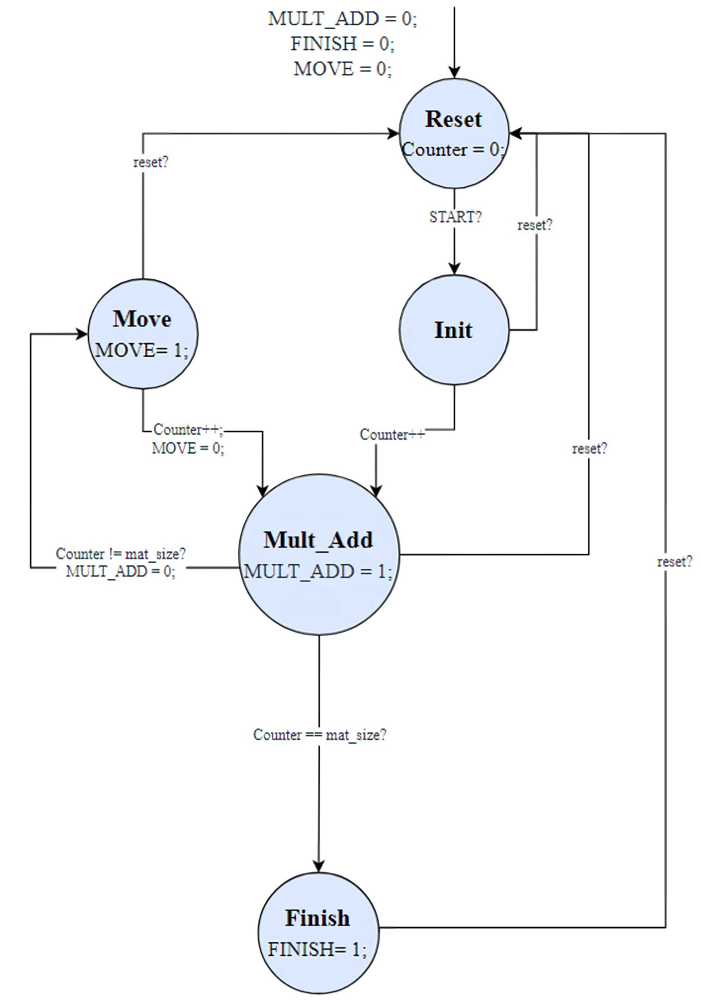

# 2D Torus Systolic Array Hardware Engine in Verilog


## 📌 Overview
This repository contains a **synthesizable Verilog implementation of a 2D Torus-based Systolic Array Accelerator** for parallel matrix multiplication. 

Unlike standard 2D mesh arrays, the **Torus topology** cyclically connects array boundary edges—wrapping the rightmost outputs back into the leftmost inputs and bottommost outputs back into the top inputs. This cyclic data movement allows matrix elements to continuously circulate through the processing grid, eliminating global data broadcast bottlenecks and drastically reducing external memory bandwidth requirements.

> 🌟 **Deep Learning Application**: This Torus microkernel engine serves as the compute datapath for the [FPGA Accelerator of LeNet-5 CNN for Fashion-MNIST](https://github.com/fatemekhasraji/FashionMnist_LeNet5).

---

## 🏗 System Architecture & Datapath


## ⚡ Processing Element (PE) Design
Each **Processing Element (`PE.v`)** operates as a local Multiply-Accumulate (MAC) engine:
* **Datapath**: $16 \times 16$-bit signed multiplication with 32-bit local accumulation register (`psum`).
* **Direct Routing**: Assigns `down = up` and `right = left` for zero-latency pass-through to adjacent PEs.
* **Q8.8 Fixed-Point Normalization**: Right-shifts multiplication product by `FRAC_BITS` (8 bits) before accumulating.

---

## 🕹 Controller Finite State Machine (FSM)

The FSM coordinates systolic data propagation and computation timing across the Torus array.


| State | Control Signals | Function |
| :--- | :--- | :--- |
| `S_IDLE` | `MOVE=0`, `MULT_ADD=0` | Waits for high assertion on `START`. |
| `S_PRIME`| `MOVE=0`, `MULT_ADD=1` | Computes first MAC product for initial skewed inputs. |
| `S_RUN`  | `MOVE=1`, `MULT_ADD=1` | Cyclically shifts Torus registers and accumulates partial products across $N-1$ cycles. |
| `S_DONE` | `FINISH=1` | Signals computation completion and holds result in `Matrix_C`. |

---

## 📊 Synthesis & Resource Utilization Benchmarks

The core $5 \times 5$ Torus microkernel was synthesized targeting a **Xilinx Artix-7 XC7A100T FPGA** (`xc7a100tcsg324-1`) using Xilinx Vivado 2019.1 Out-Of-Context synthesis:

| Resource Metric | Used | Available | Utilization (%) | Notes / Hardware Insight |
| :--- | :--- | :--- | :--- | :--- |
| **Slice LUTs** | **1,616** | 63,400 | **2.55%** | Combinational logic & adder trees |
| **Slice Registers** | **3,206** | 126,800 | **2.53%** | Flip-Flops & Torus shift registers |
| **DSP48E1 Multipliers**| **25** | 240 | **10.42%** | Exactly 25 DSPs for 5x5 PE grid |
| **Block RAM (BRAM)** | **0** | 135 | **0.00%** | Compute engine uses register streaming |
| **Worst Negative Slack**| **+2.129 ns**| - | - | Positive setup slack @ 100 MHz |
| **Max Frequency ($f_{max}$)**| **127.05 MHz**| - | - | High throughput & low routing congestion |

---

## 🛠 Project Structure

```
torus-systolic-array-verilog/
├── README.md                # Project documentation
├── LICENSE                  # MIT License
├── rtl/                     # Synthesizable Verilog Source Files
│   ├── Controller.v         # FSM Tile Controller
│   ├── PE.v                 # Processing Element MAC engine
│   └── SA.v                 # 2D Torus Systolic Array top module
└── tb/                      # Testbenches
    └── tb_direct_torus.v    # Simulation testbench
```

---

## 🚀 How to Run Simulation

### Via Xilinx Vivado:
1. Open Vivado and load the source files from `rtl/` and testbench from `tb/`.
2. Set `tb_direct_torus` as the top simulation module.
3. Run behavioral simulation
---

## 📜 License
Distributed under the [MIT License](LICENSE).
```
